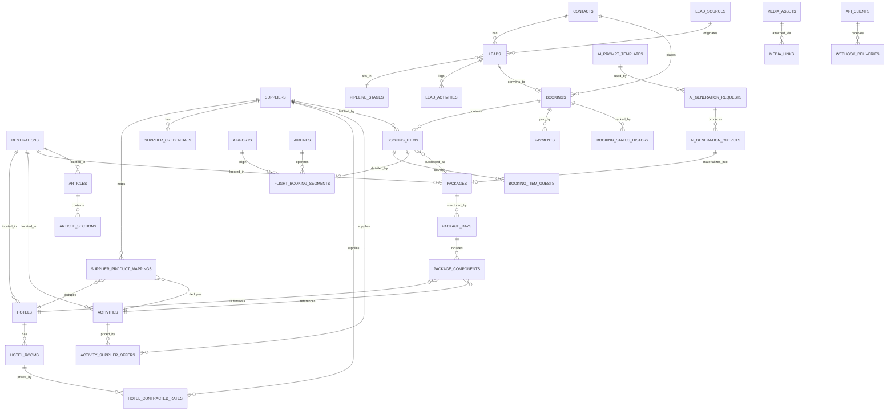

# The Vacation Voice — Travel ERP
## Database Schema Design

**Engine assumption:** PostgreSQL (JSONB for supplier-variable payloads, native range types for rate validity, row-level security path for future multi-tenancy, and a straightforward Vercel Marketplace path via Neon).
**Status:** Design only — no DDL has been executed. This is the target data model for Phase 3 ("Real data layer") of [ARCHITECTURE_MIGRATION.md](ARCHITECTURE_MIGRATION.md).

---

## 0. Design principles

Two requirements — **avoid duplicate data** and **supplier agnostic** — drive every decision below, so they're worth stating explicitly before the tables:

1. **Canonical entity vs. supplier offer, always split in two.** A hotel, an activity, an airport is a *fact about the world* that exists independent of who sells it. A rate, an availability window, a fare is a *fact about a supplier's offer* on that entity. Mixing the two is what causes duplicate hotel/activity rows per supplier. Every inventory domain below follows: **canonical table** (one row per real-world thing) + **supplier offer/mapping table** (one row per supplier's relationship to that thing).
2. **No supplier name ever appears as a column or table prefix.** There is no `tripjack_hotels` table. There is a `suppliers` table with a row `code = 'tripjack'`, and every other table references `supplier_id`. Adding Amadeus, Hotelbeds, or a second Andaman DMC later is a data change, not a schema change.
3. **Live, fast-changing supplier data is not persisted as source of truth.** Flight schedules and real-time hotel availability churn constantly and are cheap to re-fetch; persisting them long-term both duplicates the supplier's own database and goes stale. These live in the caching layer (Section 6) and only get written to Postgres once — as an immutable snapshot — at the moment of booking.
4. **Shared concerns get one table, referenced everywhere, not repeated per module.** Images, SEO metadata, geography, and money/currency each get a single table used by every domain that needs them (`media_links`, `seo_metadata`, `destinations`, `currencies`) instead of an `image_url` column duplicated across ten tables.
5. **Bookings never point at "live" canonical data for pricing/legal terms.** A `booking_items.snapshot` JSONB column freezes the name, price, and terms exactly as they were at purchase time. If a hotel's canonical name or an activity's price changes next month, historical bookings must not silently change with them.

---

## 1. Table list (grouped by domain)

### 1.1 Shared / Core
| Table | Purpose |
|---|---|
| `users` | Internal staff accounts (agents, ops, admins) |
| `roles`, `permissions`, `role_permissions` | RBAC for internal users |
| `currencies` | ISO currency reference (code, symbol, decimals) |
| `exchange_rates` | Daily FX rates between currency pairs |
| `countries`, `regions`, `destinations` | Geography hierarchy — one shared tree used by hotels, activities, packages, CRM, and CMS |
| `media_assets` | Every image/video, uploaded once |
| `media_links` | Polymorphic join: attaches a `media_asset` to any entity (`entity_type`, `entity_id`, `position`) |
| `seo_metadata` | Polymorphic: meta title/description/canonical per entity (packages, articles, landing pages) |
| `audit_log` | Generic `entity_type`/`entity_id`/`action`/`actor_id`/`diff` trail |

### 1.2 Supplier Integration Layer (makes everything below "supplier agnostic")
| Table | Purpose |
|---|---|
| `suppliers` | One row per integration: TripJack, direct-contracted, future Amadeus/Hotelbeds/RateHawk, etc. |
| `supplier_credentials` | Encrypted API keys/secrets per supplier per environment (never in source — closes the leak found in the current codebase) |
| `supplier_product_mappings` | **The dedup table.** Maps `(supplier_id, internal_entity_type, supplier_external_id)` → one canonical entity. Prevents the same physical hotel from ever getting a second row because a second supplier also sells it |
| `supplier_sync_logs` | Ingestion/reconciliation run history per supplier |

### 1.3 Hotels
| Table | Purpose |
|---|---|
| `hotels` | Canonical property: one row per physical hotel, regardless of how many suppliers sell it |
| `hotel_rooms` | Room types belonging to a hotel |
| `hotel_contracted_rates` | Persisted rates for direct/contracted inventory (season-based, `valid_from`/`valid_to`) — *not* live TripJack search results, which are cache-only (Section 6) |

### 1.4 Flights
| Table | Purpose |
|---|---|
| `airports` | IATA reference data |
| `airlines` | IATA reference data |
| `flight_booking_segments` | Immutable snapshot of a booked flight (PNR, times, fare class, supplier payload) — created only at booking time; there is deliberately no canonical "flight schedule" table since schedules are 100% supplier-owned and change too fast to warehouse |

### 1.5 Activities (and any similarly-shaped inventory: ferries, transfers, transport)
| Table | Purpose |
|---|---|
| `activities` | Canonical activity/experience: one row per real offering (e.g. "Elephant Beach Snorkelling"), `category` distinguishes activity vs. ferry vs. transfer so new transport types don't need new tables |
| `activity_supplier_offers` | Persisted price/validity per supplier per activity — activities behave like contracted inventory (semi-static pricing), unlike flights |

### 1.6 CRM
| Table | Purpose |
|---|---|
| `contacts` | One row per person (customer/lead), deduplicated by email/phone |
| `lead_sources` | Channel + UTM + originating landing page |
| `pipeline_stages` | Kanban columns (New Lead, Quote Sent, Follow-up, Converted, Lost) |
| `leads` | A contact's active interest — stage, assigned agent, estimated value |
| `lead_activities` | Notes/calls/emails/WhatsApp log against a lead |

### 1.7 Bookings (the polymorphic core)
| Table | Purpose |
|---|---|
| `bookings` | Order header: reference, contact, currency, total, status |
| `booking_items` | One row per purchased line item (hotel stay / flight / activity / package / ferry) via `item_type` discriminator, with frozen `snapshot` JSONB |
| `booking_item_guests` | Guest/traveler names & documents per line item |
| `payments` | Payment transactions against a booking (gateway, amount, status) |
| `booking_status_history` | Full audit trail of status transitions |

### 1.8 Dynamic Packages
| Table | Purpose |
|---|---|
| `packages` | A sellable package: title, destination, duration, base price, status |
| `package_days` | Day-by-day itinerary structure |
| `package_components` | Links a package day to a canonical entity (`hotel`, `activity`, `flight` route, `ferry`) plus whether it's included or an add-on |

### 1.9 AI
| Table | Purpose |
|---|---|
| `ai_prompt_templates` | Versioned prompt templates per purpose (package builder, guide writer, itinerary suggestion) |
| `ai_generation_requests` | Every generation call: who requested it, purpose, input, model, params |
| `ai_generation_outputs` | The model's output, structured JSON, token/latency metrics, and whether it was accepted — `packages.ai_generated_from_id` closes the loop back for provenance |

### 1.10 Website API / CMS
| Table | Purpose |
|---|---|
| `articles` | Guides/blog posts (matches the existing CMS Guides feature) |
| `article_sections` | Ordered content blocks per article (hero/intro/richtext/faq/etc., matching the existing `ArticleSection` shape) |
| `landing_pages` | Campaign/destination landing pages, config-driven instead of generated PHP strings |
| `api_clients` | API keys/scopes/rate limits for the public website consuming this data |
| `webhook_endpoints`, `webhook_deliveries` | Outbound event delivery (lead capture, booking confirmation) — replaces the single hardcoded webhook URL currently baked into the PHP generator |

**Total: ~42 tables** across 10 domains, versus the current 0.

---

## 2. ER Diagram

Simplified to primary relationships for legibility — full column lists are in Section 1/3.

---

## 3. Relationships (narrative FK detail)

| From | To | Cardinality | Notes |
|---|---|---|---|
| `hotels.destination_id` | `destinations.id` | N:1 | |
| `hotel_rooms.hotel_id` | `hotels.id` | N:1 | |
| `hotel_contracted_rates.hotel_room_id` | `hotel_rooms.id` | N:1 | |
| `hotel_contracted_rates.supplier_id` | `suppliers.id` | N:1, nullable | Null = direct-contracted, no external supplier |
| `activities.destination_id` | `destinations.id` | N:1 | |
| `activity_supplier_offers.activity_id` | `activities.id` | N:1 | |
| `activity_supplier_offers.supplier_id` | `suppliers.id` | N:1 | |
| `supplier_product_mappings.supplier_id` | `suppliers.id` | N:1 | |
| `supplier_product_mappings.(internal_entity_type, internal_entity_id)` | polymorphic → `hotels`/`activities`/`airports`/`airlines` | N:1 | No FK constraint possible on a polymorphic pair — enforced at the application/service layer plus a `CHECK` on `internal_entity_type` |
| `flight_booking_segments.origin_airport_id` / `destination_airport_id` | `airports.id` | N:1 each | |
| `flight_booking_segments.airline_id` | `airlines.id` | N:1 | |
| `flight_booking_segments.booking_item_id` | `booking_items.id` | 1:1 | |
| `leads.contact_id` | `contacts.id` | N:1 | |
| `leads.pipeline_stage_id` | `pipeline_stages.id` | N:1 | |
| `leads.lead_source_id` | `lead_sources.id` | N:1 | |
| `lead_sources.landing_page_id` | `landing_pages.id` | N:1, nullable | Ties CRM directly to Website API attribution |
| `lead_activities.lead_id` | `leads.id` | N:1 | |
| `bookings.contact_id` | `contacts.id` | N:1 | |
| `bookings.lead_id` | `leads.id` | N:1, nullable | The lead that converted, if any |
| `booking_items.booking_id` | `bookings.id` | N:1 | |
| `booking_items.supplier_id` | `suppliers.id` | N:1, nullable | Null for internal/package-only items |
| `booking_items.package_id` | `packages.id` | N:1, nullable | Set when the item was purchased as part of a package |
| `booking_item_guests.booking_item_id` | `booking_items.id` | N:1 | |
| `payments.booking_id` | `bookings.id` | N:1 | |
| `booking_status_history.booking_id` | `bookings.id` | N:1 | |
| `packages.destination_id` | `destinations.id` | N:1 | |
| `packages.ai_generated_from_id` | `ai_generation_outputs.id` | N:1, nullable | |
| `package_days.package_id` | `packages.id` | N:1 | |
| `package_components.package_day_id` | `package_days.id` | N:1 | |
| `package_components.(reference_entity_type, reference_entity_id)` | polymorphic → `hotels`/`activities` | N:1 | Same polymorphic pattern as supplier mappings |
| `ai_generation_requests.prompt_template_id` | `ai_prompt_templates.id` | N:1, nullable | |
| `ai_generation_requests.requested_by_user_id` | `users.id` | N:1 | |
| `ai_generation_outputs.request_id` | `ai_generation_requests.id` | N:1 | |
| `article_sections.article_id` | `articles.id` | N:1 | |
| `articles.destination_id` | `destinations.id` | N:1, nullable | |
| `media_links.(entity_type, entity_id)` | polymorphic → any entity | N:1 | |
| `media_links.media_id` | `media_assets.id` | N:1 | |
| `seo_metadata.(entity_type, entity_id)` | polymorphic → `packages`/`articles`/`landing_pages` | 1:1 | |
| `webhook_deliveries.client_id` | `api_clients.id` | N:1 | |
| `webhook_deliveries.endpoint_id` | `webhook_endpoints.id` | N:1 | |

---

## 4. Indexes

General rule: **every FK column gets a btree index** (Postgres does not create these automatically — this alone fixes a common silent scan-heavy-query source). Beyond that baseline, the indexes below target the app's actual query patterns:

| Table | Index | Reason |
|---|---|---|
| `bookings` | UNIQUE btree on `booking_reference` | Lookup by human-facing reference |
| `bookings` | btree on `(status, created_at)` | Ops dashboard "open bookings this month" |
| `bookings` | BRIN on `created_at` | Cheap index for a large, append-mostly, time-ordered table |
| `booking_items` | btree on `(item_type, status)` | "All pending hotel items" style queries |
| `booking_items` | GIN on `snapshot` (jsonb_path_ops) | Occasional ad hoc queries into frozen booking data without a schema migration |
| `supplier_product_mappings` | UNIQUE btree on `(supplier_id, internal_entity_type, supplier_external_id)` | Enforces the dedup guarantee itself; also the upsert key during supplier sync |
| `supplier_product_mappings` | btree on `(internal_entity_type, internal_entity_id)` | Reverse lookup: "which suppliers sell this hotel" |
| `hotels` | GIN trigram (`pg_trgm`) on `name` | Fuzzy/partial hotel name search in the admin UI |
| `hotels` | btree on `destination_id` | Filter hotels by destination |
| `hotel_contracted_rates` | btree on `(hotel_room_id, valid_from, valid_to)` | Date-range rate lookup |
| `hotel_contracted_rates` | GiST exclusion constraint on `(hotel_room_id, daterange(valid_from, valid_to))` | Prevents two overlapping season rates for the same room being entered by mistake |
| `activities` | btree on `destination_id`, GIN trigram on `name` | Same pattern as hotels |
| `activity_supplier_offers` | btree on `(activity_id, valid_from, valid_to)` | Same rate-range pattern |
| `leads` | btree on `(assigned_to_user_id, status)` | "My open leads" — the CRM board's core query |
| `leads` | btree on `pipeline_stage_id` | Kanban column population |
| `contacts` | UNIQUE btree on `email` (partial: `WHERE email IS NOT NULL`) | Dedup contacts without breaking on legitimately-null emails |
| `lead_activities` | btree on `(lead_id, created_at)` | Chronological timeline render |
| `articles`, `landing_pages` | UNIQUE btree on `slug` | Public URL resolution — this is the hot path for the Website API |
| `articles` | GIN full-text (`to_tsvector`) on `title || body` | Guide search |
| `ai_generation_requests` | btree on `(requested_by_user_id, created_at)`, on `purpose` | Usage/cost auditing per user and per feature |
| `exchange_rates` | UNIQUE btree on `(base_currency, quote_currency, as_of_date)` | One rate per pair per day |
| `api_clients` | UNIQUE btree on `api_key_hash` | Auth lookup on every public API request — must be O(1) |
| `audit_log` | btree on `(entity_type, entity_id, created_at)` | "History of this record" queries |

---

## 5. Caching Strategy

Layered by *volatility* and *criticality* — the two axes that determine whether something belongs in Postgres, Redis, or the CDN edge:

**1. Live supplier search results (flights, real-time hotel availability) — Redis, cache-aside, short TTL.**
Never written to Postgres as source of truth. Key shape: `search:{supplier}:{type}:{hash(params)}` (e.g. `search:tripjack:flight:a1b2c3`), TTL 5–15 minutes matching the supplier's own quote validity. On booking, the app performs a **live re-check/re-price call to the supplier** before confirming — the cached search result is only ever a UI convenience, never the price actually charged. This directly fixes the current app's biggest gap: today `AiStudio`/itinerary pages fake this with hardcoded arrays and `setTimeout`; this is the real replacement.

**2. Contracted rates (hotel/activity) — Postgres is the source of truth, Redis as read-through cache.**
`hotel_contracted_rates` / `activity_supplier_offers` change rarely (seasonal). Cache the resolved "price for these dates" computation per entity with a 1–6 hour TTL, invalidated immediately on admin write (write-through: update Postgres, delete the Redis key in the same transaction/request).

**3. Session & rate limiting — Redis, always.**
Internal user sessions and public `api_clients` rate-limit counters (sliding-window) live in Redis exclusively; never persisted to Postgres.

**4. Reference/lookup data — long-TTL Redis or in-process memory, event-invalidated.**
`countries`, `regions`, `destinations`, `currencies`, `exchange_rates`, `pipeline_stages` change rarely and are read on nearly every request. Cache for hours with explicit invalidation on admin edit, not TTL-only expiry — stale currency symbols are harmless, but a stale exchange rate silently mispricing a booking is not.

**5. Website API (public-facing) — CDN/edge cache with tag-based invalidation, not just Redis.**
`articles`, `landing_pages`, and published `packages` are read far more than written. Serve through Next.js/Vercel's edge cache (ISR / Cache Components) keyed by slug, with `revalidateTag` fired from the CMS write path the moment an editor publishes — so cache correctness is push-based, not poll-based. This replaces the current setup, where landing pages are static PHP files exported once and never invalidate at all.

**6. Aggregated dashboard/reporting numbers — materialized view or short-TTL cache, not live aggregation.**
Revenue/bookings/lead-conversion widgets should not run full aggregate queries against `bookings`/`booking_items` on every dashboard load. Use a Postgres materialized view refreshed on a schedule (or on booking-write via a lightweight trigger-driven counter table) with a 1–5 minute cache in front of it.

**Cache correctness rule of thumb applied throughout:** anything that affects money owed or contractual terms (final prices, booking status, payment state) is write-through or invalidate-on-write, never TTL-only. Anything that's read-heavy and low-stakes if briefly stale (content, reference data, dashboard counts) is TTL-based for simplicity.

---

## 6. Future Expansion

The schema is deliberately structured so each of these is an *additive* change — new tables/columns/rows — not a redesign:

- **Multi-tenancy** (white-labeling the ERP for other travel agencies): add a nullable `tenant_id` to top-level tables (`bookings`, `leads`, `packages`, `articles`) plus Postgres row-level security policies. The canonical/supplier-offer split already isolates "what a supplier sells" from "who's selling it," so tenants can share the same hotel/activity catalog without re-syncing supplier data per tenant.
- **New suppliers** (Amadeus, Hotelbeds, RateHawk, Sabre, a second DMC): a new row in `suppliers` plus new rows in `supplier_product_mappings`. Zero schema changes, by construction.
- **New inventory types** (car rentals, visas, travel insurance, cruises): add the value to `booking_items.item_type`, and add one canonical + one supplier-offer table following the exact pattern `activities`/`activity_supplier_offers` already establishes. Bookings, CRM, AI, and Website API domains need no changes.
- **Read/write separation:** primary Postgres for OLTP (bookings, CRM), a read replica for the Website API and BI dashboards, keeping reporting load off the transactional path.
- **Partitioning:** once `bookings`/`booking_items`/`audit_log` grow large, convert to native Postgres declarative partitioning by `created_at` (monthly/yearly) — no application-level change required since partitioned tables are queried identically.
- **Event-driven integrations:** add a `domain_events` outbox table populated by triggers/application code on `bookings`/`leads` writes, consumed by a queue (accounting export, WhatsApp/email automation, analytics warehouse). This retires the current app's single hardcoded webhook URL in favor of proper pub/sub through the existing `webhook_endpoints`/`webhook_deliveries` tables.
- **Search at scale:** migrate `hotels`/`activities`/`articles` search from Postgres `pg_trgm`/full-text to a dedicated engine (Typesense/Meilisearch/Elasticsearch) once catalog size or query complexity (faceting, geo-search) outgrows Postgres-native search — the canonical tables don't change, only what indexes them.
- **AI/semantic search:** add `pgvector` (or an external vector store) for embedding-based package recommendations and semantic search over `articles`/`ai_generation_outputs`, once there's enough accepted-output volume to make retrieval useful.
- **Analytics warehouse:** periodic replication (logical replication or a Marketplace warehouse connector) from Postgres into a columnar store for BI, keeping heavy analytical queries off the OLTP database entirely.
- **Localization:** a polymorphic `entity_translations` table (same pattern as `media_links`) for multi-language `articles`/`packages`, rather than duplicating rows per language.
