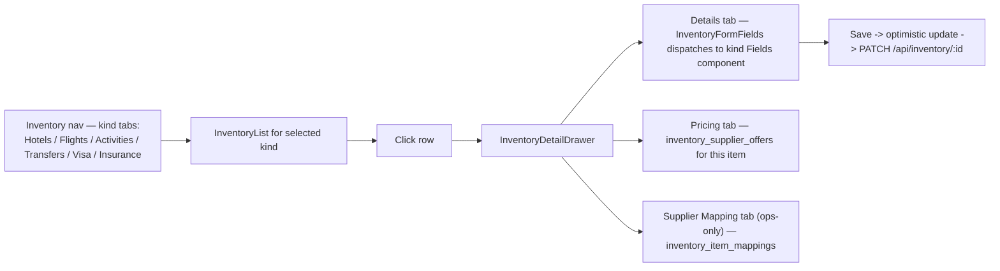
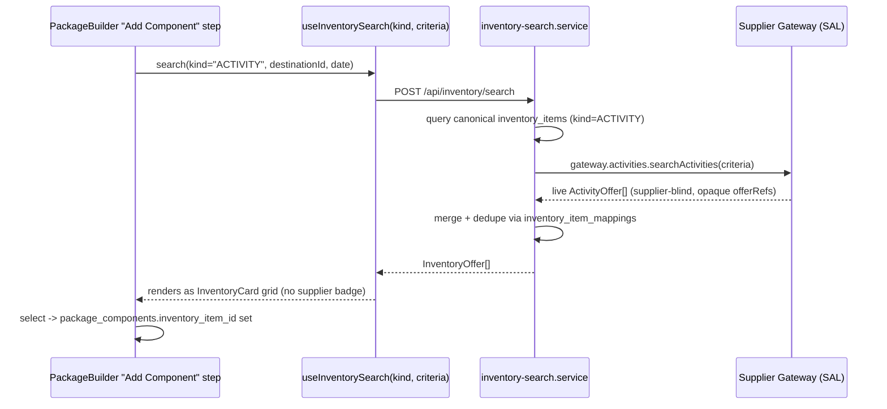
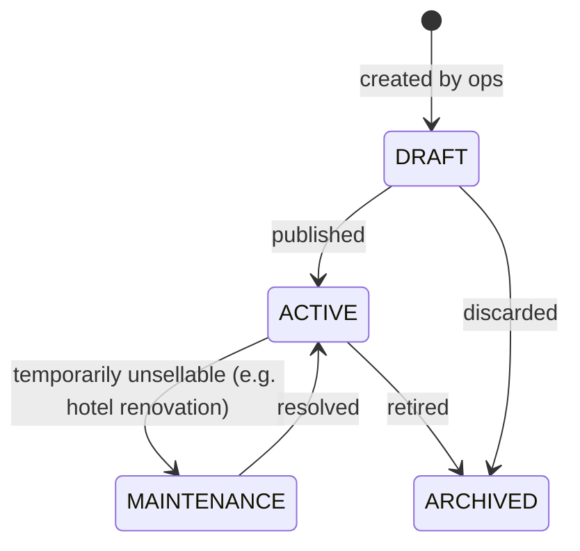

# The Vacation Voice — Travel ERP
## Inventory System Redesign

**Status:** Design only — no implementation. This document **supersedes the per-domain tables** in [DATABASE_SCHEMA.md](DATABASE_SCHEMA.md) §1.3–1.5 (`hotels`/`hotel_contracted_rates`, `activities`/`activity_supplier_offers`, the polymorphic-pair `supplier_product_mappings`) and sits directly on top of the Ports/Adapters from [SUPPLIER_ABSTRACTION_LAYER.md](SUPPLIER_ABSTRACTION_LAYER.md). Where the two documents disagree, this one wins — the reconciliation is explained inline in Section 3.

---

## 0. The redesign in one sentence

Today (and even in the original schema draft), Hotels, Activities, Flights, and Transfers were four parallel, near-identical structures — each with its own canonical table, its own offer/rate table, its own search UI, its own state management. **Inventory collapses that into one polymorphic core** — `inventory_items` + a per-kind detail extension + one shared offer table + one shared supplier-mapping table — so that adding Visa and Insurance (two kinds with no prior tables at all) requires *zero* new architecture, just two new rows in a kind registry and two new detail tables. "Everything should use Inventory" is enforced the same way the Supplier layer enforced "nothing should know TripJack exists": structurally, not by convention.

---

## 1. Folder Structure

Existing routes are **preserved** (per the constraint set in [ARCHITECTURE_MIGRATION.md](ARCHITECTURE_MIGRATION.md)) — `/itinerary/hotels`, `/itinerary/flights`, `/itinerary/activities`, `/itinerary/ferry-rates` keep their URLs. What changes is that each becomes a thin, kind-parameterized wrapper around one shared engine instead of a hand-built page.

```
src/
  domain/
    inventory/
      models/
        inventory-item.ts            # base polymorphic type: { id, kind, destinationId, title, status }
        inventory-kind.ts            # enum: HOTEL | FLIGHT | ACTIVITY | TRANSFER | VISA | INSURANCE
        kinds/
          hotel-item.ts              # HotelItem = InventoryItem & { starRating, address, rooms }
          flight-item.ts             # FlightItem = InventoryItem & { originAirport, destAirport }  (see §3.1 — "item" here means Route, not a specific flight)
          activity-item.ts
          transfer-item.ts
          visa-item.ts               # VisaItem = InventoryItem & { countryId, visaType, processingDays, entryType }
          insurance-item.ts          # InsuranceItem = InventoryItem & { providerName, coverageAmount, termDays }
      ports/
        inventory-repository.port.ts # canonical CRUD, kind-agnostic
      registry/
        inventory-kind-registry.ts   # THE plug-in point: maps kind -> { detailSchema, filterSchema, columns, FieldsComponent, supplierPort }

  suppliers/                         # unchanged from SUPPLIER_ABSTRACTION_LAYER.md
    gateway/  tripjack/  tbo/  hotelbeds/  makruzz/  manual/

  services/
    inventory/
      inventory-catalog.service.ts   # create/update/publish/archive — kind-agnostic
      inventory-search.service.ts    # merges canonical catalog + live SAL Gateway search, deduped via mappings
      inventory-pricing.service.ts   # resolves display price: contracted vs. live-quoted vs. package override
      inventory-mapping.service.ts   # link/unlink a supplier's external id to a canonical inventory_item

  state/
    inventory/
      inventory-query-keys.ts        # one key factory for every kind — no per-page cache key drift
      use-inventory-list.ts          # useInventoryList(kind, filters)
      use-inventory-item.ts          # useInventoryItem(kind, id)
      use-inventory-search.ts        # useInventorySearch(kind, criteria) — live + canonical merge
      use-inventory-mutations.ts     # create/update/archive/link-mapping, all kind-agnostic
      inventory-ui.store.ts          # UI-only state: selected row, drawer open, active filters (never server data)

  components/
    inventory/
      InventoryList.tsx              # generic table/grid — columns come from the kind registry
      InventoryCard.tsx              # generic search-result card
      InventoryFilters.tsx           # generic filter bar — fields come from the kind registry
      InventoryDetailDrawer.tsx      # Details / Pricing / Supplier Mapping tabs
      InventoryFormFields.tsx        # dispatches to the right Fields component by kind
      InventoryStatusBadge.tsx
      InventoryPriceTag.tsx          # resolves & renders Money — never raw supplier data
      InventorySupplierBadge.tsx     # ops-only chip; never rendered on customer/package-builder surfaces
      kinds/
        HotelFields.tsx  FlightFields.tsx  ActivityFields.tsx
        TransferFields.tsx  VisaFields.tsx  InsuranceFields.tsx

  app/
    itinerary/
      hotels/page.tsx                # <InventoryList kind="HOTEL" />        — URL preserved
      flights/page.tsx               # <InventoryList kind="FLIGHT" />       — URL preserved
      activities/page.tsx            # <InventoryList kind="ACTIVITY" />     — URL preserved
      ferry-rates/page.tsx           # <InventoryList kind="TRANSFER" mode="FERRY" /> — URL preserved
    inventory/
      visa/page.tsx                  # new kind, new route — <InventoryList kind="VISA" />
      insurance/page.tsx             # new kind, new route — <InventoryList kind="INSURANCE" />
    api/
      inventory/                     # see §4
```

**Why this collapses cleanly:** every existing itinerary page (from the original codebase review) already followed the same shape — search bar, table, add-modal. That duplication was flagged as a P1 problem in the migration doc; Inventory is the fix, not a new idea layered on top.

---

## 2. Components

All components are **kind-agnostic containers** driven by `inventory-kind-registry.ts`. Adding Visa/Insurance means writing one `Fields` component and one registry entry — `InventoryList`, `InventoryCard`, `InventoryFilters`, `InventoryDetailDrawer` never change.

| Component | Responsibility | Key props |
|---|---|---|
| `InventoryList` | Renders the admin table/grid for one kind | `kind`, `filters`, `onSelect` |
| `InventoryCard` | Renders one searchable offer (used in package builder, future customer site) | `item: InventoryItem \| InventoryOffer`, `kind`, `showSupplierBadge?` (ops context only) |
| `InventoryFilters` | Dynamic filter bar; fields come from `registry[kind].filterSchema` | `kind`, `value`, `onChange` |
| `InventoryDetailDrawer` | Side panel: Details / Pricing / Supplier Mapping tabs | `kind`, `id`, `onClose` |
| `InventoryFormFields` | Pure dispatcher — looks up `registry[kind].FieldsComponent` and renders it | `kind`, `value`, `onChange` |
| `HotelFields` / `FlightFields` / `ActivityFields` / `TransferFields` / `VisaFields` / `InsuranceFields` | Dumb, kind-specific form sections — the only place kind-specific UI logic lives | `value`, `onChange` |
| `InventoryStatusBadge` | Draft / Active / Archived / Maintenance | `status` |
| `InventoryPriceTag` | Resolves display price via `inventory-pricing.service` | `inventoryItemId`, `pricingMode` |
| `InventorySupplierBadge` | Ops-only chip ("TripJack", "Manual") | `supplierCode` — **never mounted** in package-builder/customer-facing trees, per the SAL rule that the business path stays supplier-blind |
| `InventoryBookingCartButton` | "Add to package" / "Add to booking" — identical for all 6 kinds because every kind implements the same offer shape | `offerRef \| inventoryItemId`, `kind` |

---

## 3. Database

This section **redesigns**, not just extends, the previous schema — consolidating what were separate per-domain tables into one polymorphic core.

### 3.1 Core tables

```
inventory_items
  id                UUID PK
  kind              ENUM('HOTEL','FLIGHT','ACTIVITY','TRANSFER','VISA','INSURANCE')
  destination_id    FK -> destinations.id, nullable   (Visa/Insurance may be country-scoped, not destination-scoped)
  title             TEXT
  status            ENUM('DRAFT','ACTIVE','ARCHIVED','MAINTENANCE')
  created_by        FK -> users.id
  created_at, updated_at
```
One row per sellable *thing*, regardless of kind. `media_links`, `seo_metadata`, and `audit_log` from the shared/core layer attach here (`entity_type = 'inventory_item'`) — no new media/SEO tables needed, reusing exactly what already exists.

### 3.2 Per-kind detail tables (1:1 extension, not one sparse table)

```
inventory_item_details_hotel      (inventory_item_id PK/FK, star_rating, address, latitude, longitude)
inventory_item_details_activity   (inventory_item_id PK/FK, duration_minutes, category)
inventory_item_details_transfer   (inventory_item_id PK/FK, mode ENUM('FERRY','ROAD'), origin_destination_id FK, target_destination_id FK)
inventory_item_details_visa       (inventory_item_id PK/FK, country_id FK, visa_type ENUM('TOURIST','BUSINESS','TRANSIT'), entry_type ENUM('SINGLE','MULTIPLE'), processing_days, validity_days, required_documents JSONB)
inventory_item_details_insurance  (inventory_item_id PK/FK, provider_name, coverage_amount, currency_id FK, term_days, terms_url)
inventory_item_details_flight     (inventory_item_id PK/FK, origin_airport_id FK, destination_airport_id FK)   -- see 3.3 for why this row means "Route," not "a specific flight"
```
Each kind gets exactly the columns it needs; no `NULL`-heavy shared mega-table, no cross-kind column collisions. `hotel_rooms` from the previous doc still exists as a child of `inventory_item_details_hotel` unchanged.

### 3.3 The Flight special case (explicit, not glossed over)

Per [SUPPLIER_ABSTRACTION_LAYER.md](SUPPLIER_ABSTRACTION_LAYER.md), flight *schedules* are 100% supplier-live and change too fast to warehouse. So `inventory_items` where `kind='FLIGHT'` does not represent a bookable flight — it represents a **Route** (an origin/destination city pair, e.g. "Chennai → Port Blair"), used for catalog browsing, package templates, and analytics ("which routes do we sell"). The actual bookable thing is always a live `FlightOffer` from the Supplier Gateway, never a persisted `inventory_supplier_offers` row. This is intentional, not an oversight — flights are the one kind where "Inventory" means *the concept*, and a booked instance only materializes into `booking_items.snapshot` at purchase time, exactly as designed previously.

### 3.4 One shared offer table (replaces `hotel_contracted_rates` + `activity_supplier_offers`)

```
inventory_supplier_offers
  id                 UUID PK
  inventory_item_id  FK -> inventory_items.id
  supplier_id        FK -> suppliers.id
  price              NUMERIC
  currency_id        FK -> currencies.id
  valid_from         DATE
  valid_to           DATE
  raw_payload        JSONB
```
This is the direct consolidation: the earlier schema had `hotel_contracted_rates` and `activity_supplier_offers` as two structurally identical tables differing only in which canonical table they pointed to. Now that everything is an `inventory_item`, one table serves Hotels, Activities, Transfers, Visa, and Insurance (Flights excluded per §3.3). Adding a 7th kind later (car rentals, cruises) needs **no new offer table**.

### 3.5 One shared supplier-mapping table (replaces the polymorphic-pair `supplier_product_mappings`)

```
inventory_item_mappings
  id                    UUID PK
  inventory_item_id     FK -> inventory_items.id      -- real FK now, not a (type, id) pair
  supplier_id           FK -> suppliers.id
  supplier_external_id  TEXT
  match_confidence      NUMERIC, nullable              -- set by auto-matching (see §6), null for manual links
  confirmed_by_user_id  FK -> users.id, nullable
  extra                 JSONB
  UNIQUE (supplier_id, supplier_external_id)
```
This is a genuine improvement over the earlier design, not just a rename: the previous `supplier_product_mappings.(internal_entity_type, internal_entity_id)` pair could not be enforced as a real foreign key. Because every kind now shares one `inventory_items` table, `inventory_item_mappings.inventory_item_id` is a normal, DB-enforced FK.

### 3.6 Downstream tables now point at Inventory, not at per-domain tables

```
booking_items.inventory_item_id    FK -> inventory_items.id   (replaces the old loosely-typed item_type + separate FK columns)
package_components.inventory_item_id FK -> inventory_items.id (replaces separate hotel/activity reference columns)
```
This is the literal enforcement of "everything should use Inventory": Bookings and Packages no longer reference `hotels.id` or `activities.id` directly — there is exactly one column name, on exactly one target table, for "what did we sell," regardless of kind.

---

## 4. APIs

One parameterized surface instead of a repeated family of near-identical endpoints per domain:

```
GET    /api/inventory?kind=HOTEL&destinationId=&status=      # canonical catalog list (ops)
GET    /api/inventory/:id                                     # canonical item detail
POST   /api/inventory                                          # create (kind in body, routed to the right detail table)
PATCH  /api/inventory/:id
POST   /api/inventory/:id/archive

POST   /api/inventory/search                                   # { kind, criteria } -> merges canonical + live SAL Gateway results, deduped via inventory_item_mappings
POST   /api/inventory/search/requote                            # { kind, offerRef } -> delegates to Gateway.<kind>.quotePrice

POST   /api/inventory/:id/mappings                              # link a supplier external id to this canonical item (ops)
DELETE /api/inventory/:id/mappings/:mappingId
GET    /api/inventory/mapping-suggestions                       # queue of auto-matched, unconfirmed supplier entities (§6)

GET    /api/public/inventory?kind=ACTIVITY&destinationId=       # same service, public/cached, used by the Website API
```

`kind` is always an explicit parameter, never inferred from the URL path — this is what lets `InventoryList`/`InventoryCard`/the query hooks stay generic instead of one hook per domain. The public Website API and the internal ops UI are two thin, differently-cached callers of the *same* `inventory-search.service.ts` — not two parallel implementations.

---

## 5. State Management

Server state (React Query) and UI-only state are deliberately kept apart — the current codebase's biggest state-management problem is that `useState` holds both at once (a "mock backend" array *and* modal-open/search-text UI state, undifferentiated, per page).

**Server state — one generic hook set for all 6 kinds:**
```
inventoryKeys.list(kind, filters)
inventoryKeys.detail(kind, id)
inventoryKeys.search(kind, criteria)

useInventoryList(kind, filters)      -> GET /api/inventory
useInventoryItem(kind, id)           -> GET /api/inventory/:id
useInventorySearch(kind, criteria)   -> POST /api/inventory/search   (used by package builder / future customer search)
useCreateInventoryItem(kind)
useUpdateInventoryItem(kind, id)
useArchiveInventoryItem(kind, id)
useLinkSupplierMapping(inventoryItemId)
```
Mutations invalidate `inventoryKeys.list(kind)`/`detail(kind, id)` on success. Admin edits (status toggle, price correction) use optimistic updates with rollback-on-error — replacing today's `setHotels([hotel, ...hotels])` pattern, which "succeeds" against nothing but local memory, with a real optimistic-then-reconciled write against the API.

**UI-only state — never touches the server-state cache:**
Selected row, drawer open/closed, active filter chips, package-builder wizard step. Lives in component state or one small `inventory-ui.store.ts` (Zustand), explicitly separated so a filter-bar re-render can never be confused with a stale-data bug.

---

## 6. Supplier Mapping

This is where Inventory and the Supplier Abstraction Layer meet operationally.

**Ops flow:** `InventoryDetailDrawer`'s "Supplier Mapping" tab (visible only in the ops/admin role context — this tab is the one place in the Inventory UI where supplier identity is intentionally visible, per the "business-facing vs. ops-facing" distinction drawn in the SAL doc) lists every supplier currently linked to this canonical item — e.g. "Taj Exotica Resort & Spa" mapped to TripJack's `TJ-88213` and HotelBeds' `HB-4471` — with an "Add mapping" action that writes to `inventory_item_mappings`.

**Auto-match suggestion queue:** when a `supplier_sync_logs` run ingests a supplier's catalog, unmapped entities are fuzzy-matched against existing `inventory_items` (name similarity via `pg_trgm` + geo proximity for hotels/activities) and written as **unconfirmed** rows (`match_confidence` set, `confirmed_by_user_id` null) rather than auto-creating a second canonical item. `GET /api/inventory/mapping-suggestions` surfaces this queue; an ops user confirms (promotes to a real mapping) or rejects (creates a new canonical item if it's genuinely a new hotel/activity).

**Why this matters for dedup:** this table is exactly what the Supplier Gateway's aggregator (`dedupe.ts`, from the SAL doc) reads at search time to merge TripJack's and HotelBeds' offers for the same physical hotel into one `InventoryCard`. Getting mapping right here is what prevents "Taj Exotica" from appearing twice in search results.

---

## 7. UI Flow

### 7.1 Ops: browse and manage inventory



### 7.2 Package builder: adding a component (kind-agnostic by construction)



### 7.3 Visa & Insurance: an add-on flow, not a date-range search

Visa and Insurance don't fit the "search by destination + dates" pattern the other four kinds share — they're typically attached during checkout rather than itinerary-built. UI flow: at the booking/package checkout step, a "Recommended add-ons" panel fires `useInventoryList('VISA', { destinationId })` and `useInventoryList('INSURANCE', {})` in parallel, rendering results through the *same* `InventoryCard` component (parameterized by kind) used everywhere else. Selecting one creates a `booking_items` row with `inventory_item_id` pointing at the Visa/Insurance item — no special-cased booking logic, because the polymorphic model in §3 already made them first-class inventory, not a bolt-on.

### 7.4 Status lifecycle (shared by all 6 kinds)


One state machine, one `InventoryStatusBadge`, enforced identically whether the item is a hotel, a visa product, or an insurance policy.
