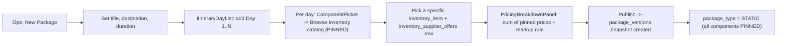
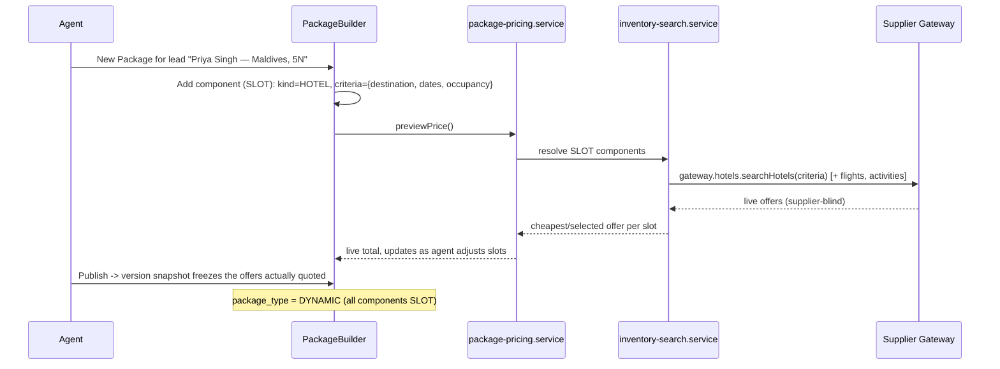
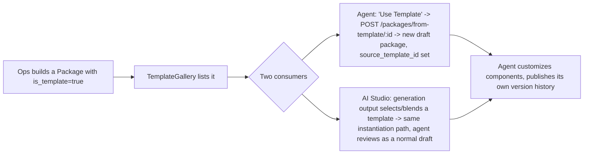
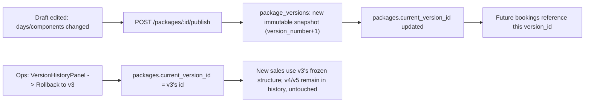

# The Vacation Voice — Travel ERP
## Package Builder Design

**Status:** Design only — no implementation. Builds on [INVENTORY_SYSTEM.md](INVENTORY_SYSTEM.md) (`inventory_items`, `inventory_supplier_offers`, `inventory_item_mappings`), [SUPPLIER_ABSTRACTION_LAYER.md](SUPPLIER_ABSTRACTION_LAYER.md) (live quoting), and the AI/Bookings tables in [DATABASE_SCHEMA.md](DATABASE_SCHEMA.md). Replaces the current `PackageBuilder.tsx` 7-step wizard, which today is entirely static UI with hardcoded `+₹12,500`/`+₹18,000` price additions and no persistence.

---

## 0. The one modeling decision everything else follows

Static, Dynamic, and Semi-Dynamic packages are not three different data structures — they are three different **mixes of one property on a package component**: `resolution_mode`.

- **`PINNED`** — this component is a specific, already-selected `inventory_item` at a specific, already-quoted `inventory_supplier_offers` row. Its price is fixed until someone deliberately re-pins it.
- **`SLOT`** — this component is a *criteria* (kind + destination + filters, e.g. "a 4-star hotel in Havelock, 2 nights"), resolved to a live offer only when a customer/agent actually needs a price — via Inventory Search → Supplier Gateway, exactly as designed in the prior two documents.

A package's `package_type` is then just a **derived, denormalized label** for display/filtering:
- **Static** = every component is `PINNED`.
- **Dynamic** = every component is `SLOT` (built fresh, per inquiry).
- **Semi-Dynamic** = a mix — typically a fixed itinerary backbone (`PINNED` activities/transfers) with swappable, price-sensitive components (`SLOT` hotel and/or flight).

This is why there's one `package_components` table below, not three.

---

## 1. User Flow

### 1.1 Static package authoring (ops builds a fixed, sellable SKU)



### 1.2 Dynamic package (agent builds live, per customer inquiry)



### 1.3 Semi-Dynamic (fixed template, swappable hotel/flight)

```mermaid
flowchart LR
    A[Start from Template: "Andaman Honeymoon"] --> B["Itinerary days + activities/transfers: PINNED (unchanged)"]
    B --> C["Hotel component: SLOT (customer picks category at booking time)"]
    C --> D["Flight component: SLOT (priced at time of booking)"]
    D --> E[PricingBreakdownPanel shows: fixed portion + live-quoted portion]
    E --> F[Publish as customer-facing package]
```

### 1.4 Package Templates (author once, reuse many times)



### 1.5 Version publish & rollback



Existing bookings are never affected by rollback — they already reference the specific `package_version_id` they were sold under (see Tables §3.4), which is exactly the same "freeze at time of sale" principle used for `booking_items.snapshot` in the base schema.

---

## 2. Components

| Component | Responsibility |
|---|---|
| `PackageBuilder` | Top-level editor shell — header (title/destination/duration), tabs for Itinerary / Pricing / Version History |
| `PackageTypeBadge` | Renders the derived Static/Dynamic/Semi-Dynamic label from the component mix |
| `ItineraryDayList` | Drag-reorderable list of `package_days`; add/remove day |
| `ItineraryDayEditor` | Component list for one day, grouped by `component_role` (Stay/Activity/Transfer/Flight/Meal/Visa/Insurance) |
| `ComponentPicker` | Add a component — toggle between **Pin** (browse `InventoryList`/`InventoryCard` from the Inventory System, select a specific offer) and **Slot** (define search criteria, resolved later) |
| `ComponentCard` | Renders one `package_component` — shows role, resolution mode badge, and either a pinned price or "Priced at booking" |
| `PricingBreakdownPanel` | Live total: sum of pinned prices + live-quoted slot prices (via `use-package-price`) + applied `package_pricing_rules` markup, itemized per component |
| `VersionHistoryPanel` | Lists `package_versions`, diffs two versions, rollback action |
| `TemplateGallery` | Browse `is_template=true` packages; "Use Template" instantiates a new draft |
| `SupplierMappingIndicator` | Ops-only — on a resolved `SLOT`, shows which supplier the live quote actually came from (reuses `InventorySupplierBadge` from the Inventory System; never rendered on any customer-facing package view) |

---

## 3. Tables

Reuses `destinations`, `currencies`, `media_links`, `seo_metadata`, `audit_log`, `inventory_items`, `inventory_supplier_offers`, `ai_generation_outputs`, `booking_items` unchanged — nothing here duplicates those.

### 3.1 `packages`
```
id                    UUID PK
title, slug           TEXT
destination_id        FK -> destinations.id
duration_days/nights  INT
package_type          ENUM('STATIC','DYNAMIC','SEMI_DYNAMIC')   -- denormalized, recomputed on every component save
status                ENUM('DRAFT','PUBLISHED','ARCHIVED')
is_template           BOOLEAN
source_template_id    FK -> packages.id, nullable, self-referencing  -- lineage when cloned from a template
current_version_id    FK -> package_versions.id, nullable
ai_generated_from_id   FK -> ai_generation_outputs.id, nullable
created_by_user_id     FK -> users.id
created_at, updated_at
```

### 3.2 `package_days` (Itinerary)
```
id            UUID PK
package_id    FK -> packages.id
day_number    INT
title         TEXT
destination_id FK -> destinations.id, nullable   -- multi-destination itineraries
```

### 3.3 `package_components` (the unifying table — Static/Dynamic/Semi-Dynamic all live here)
```
id                UUID PK
package_day_id    FK -> package_days.id
component_role    ENUM('STAY','ACTIVITY','TRANSFER','FLIGHT','MEAL','VISA','INSURANCE')
resolution_mode   ENUM('PINNED','SLOT')
inventory_item_id FK -> inventory_items.id, nullable        -- set when PINNED, or when SLOT narrows to one canonical item but many suppliers
pinned_offer_id   FK -> inventory_supplier_offers.id, nullable  -- set only when PINNED: the exact rate locked in
slot_criteria     JSONB, nullable                             -- set only when SLOT: {destinationId, dateRange, filters}
pricing_mode      ENUM('INCLUDED','ADDON')
addon_price       NUMERIC, nullable
```
A `CHECK` constraint enforces the pairing: `resolution_mode='PINNED'` requires `pinned_offer_id NOT NULL`; `resolution_mode='SLOT'` requires `slot_criteria NOT NULL`.

### 3.4 `package_versions` (Version History)
```
id                    UUID PK
package_id            FK -> packages.id
version_number        INT
snapshot              JSONB    -- frozen days + components + resolved prices at publish time
published_by_user_id  FK -> users.id
published_at          TIMESTAMP
change_note           TEXT, nullable
```
`booking_items.package_version_id` (new FK, added to the Bookings domain from the base schema) references this table directly — **not** `packages.id` — so a booking's terms never drift when the live package is edited or rolled back afterward.

### 3.5 `package_pricing_rules` (Pricing)
```
id             UUID PK
scope          ENUM('GLOBAL','DESTINATION','SUPPLIER','PACKAGE')
scope_ref_id   UUID, nullable    -- destinations.id / suppliers.id / packages.id depending on scope
markup_type    ENUM('PERCENTAGE','FLAT')
markup_value   NUMERIC
currency_id    FK -> currencies.id, nullable
priority       INT               -- resolution order when multiple rules could apply
```
Pricing resolution: cost (pinned `inventory_supplier_offers.price` or a live SLOT quote) → apply the highest-priority matching rule (package-specific beats supplier beats destination beats global) → sell price. This is what finally separates **cost** (what we pay the supplier) from **price** (what the customer pays) — a distinction the current prototype has no concept of at all.

No new table for computed totals: a resolved price breakdown is computed on demand by `package-pricing.service.ts` and cached in Redis per the caching strategy already defined in [DATABASE_SCHEMA.md](DATABASE_SCHEMA.md) §5 (short TTL, invalidated on component/rule edit) — persisting it would just be a third place prices could go stale.

---

## 4. API

```
GET    /api/packages?type=&destinationId=&status=&isTemplate=
GET    /api/packages/:id
POST   /api/packages                          # create draft; body may include sourceTemplateId
PATCH  /api/packages/:id                       # title/destination/duration edits

POST   /api/packages/:id/days                  # add itinerary day
PATCH  /api/packages/:id/days/:dayId
DELETE /api/packages/:id/days/:dayId

POST   /api/packages/:id/components            # add a component — body carries resolutionMode + either pinnedOfferId or slotCriteria
PATCH  /api/packages/:id/components/:componentId
DELETE /api/packages/:id/components/:componentId

POST   /api/packages/:id/price                 # resolve current total: pinned sum + live SLOT quotes (delegates to Supplier Gateway per Inventory §4) + pricing_rules -> itemized breakdown

POST   /api/packages/:id/publish               # snapshot -> new package_versions row, sets current_version_id
GET    /api/packages/:id/versions
POST   /api/packages/:id/versions/:versionId/rollback

POST   /api/packages/:id/clone-as-template      # sets is_template=true on a copy
POST   /api/packages/from-template/:templateId  # instantiate a new draft, source_template_id set

POST   /api/packages/:id/book                   # creates booking + booking_items referencing current_version_id
```

`POST /api/packages/:id/price` is the one endpoint every user flow above converges on — static packages call it once at publish time (all pinned, deterministic), dynamic/semi-dynamic call it repeatedly as an agent adjusts slots (live quotes), and it's the same code path either way.

---

## 5. Folder Structure

```
src/
  domain/
    package/
      models/
        package.ts               # Package, PackageStatus, PackageType (derived, not authored directly)
        package-day.ts
        package-component.ts      # ResolutionMode: 'PINNED' | 'SLOT'; ComponentRole enum
        package-version.ts
        pricing-rule.ts
      ports/
        package-repository.port.ts
        package-pricing.port.ts

  services/
    package/
      package-builder.service.ts    # draft CRUD: days, components
      package-versioning.service.ts # publish (snapshot), rollback, diff
      package-pricing.service.ts    # pinned sum + SLOT live-quote (calls inventory-search.service) + pricing_rules
      package-template.service.ts   # clone-as-template, instantiate-from-template
      package-booking.service.ts    # books a package version -> booking + booking_items

  state/
    package/
      package-query-keys.ts
      use-package.ts
      use-package-list.ts
      use-package-versions.ts
      use-package-price.ts          # debounced live price preview as components change
      use-package-mutations.ts      # add/update/remove component, publish, rollback, clone-as-template
      package-builder-ui.store.ts   # wizard step, selected day/component, drawer state — UI-only, never server data

  components/
    packages/
      PackageBuilder.tsx
      PackageTypeBadge.tsx
      ItineraryDayList.tsx
      ItineraryDayEditor.tsx
      ComponentPicker.tsx
      ComponentCard.tsx
      PricingBreakdownPanel.tsx
      VersionHistoryPanel.tsx
      TemplateGallery.tsx
      SupplierMappingIndicator.tsx

  app/
    packages/
      page.tsx                     # list — URL preserved from current app
      new/page.tsx                 # URL preserved; supports ?fromTemplate=<id>
      [id]/
        page.tsx                   # editor (current draft)
        versions/page.tsx          # version history view
    api/
      packages/                    # route handlers for the API surface above
```

`ComponentPicker`'s "Pin" mode literally embeds the Inventory System's `InventoryList`/`InventoryCard` components unchanged — Package Builder is a consumer of Inventory, not a second implementation of catalog browsing.
