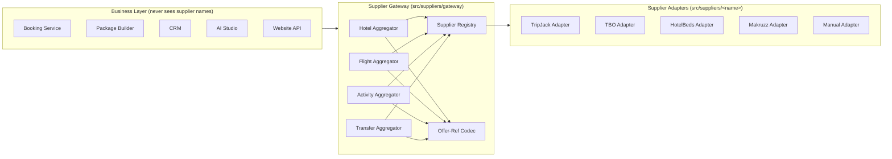
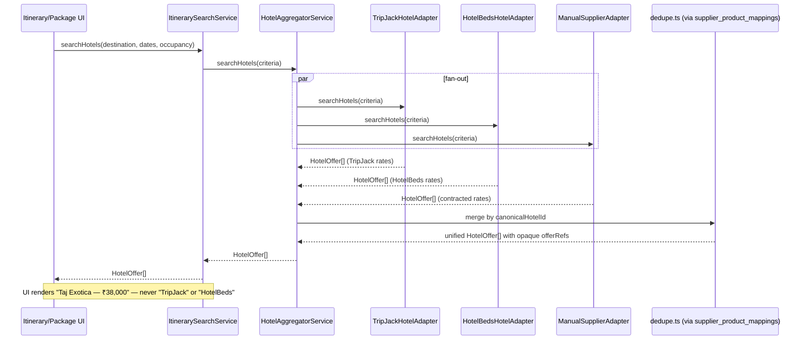
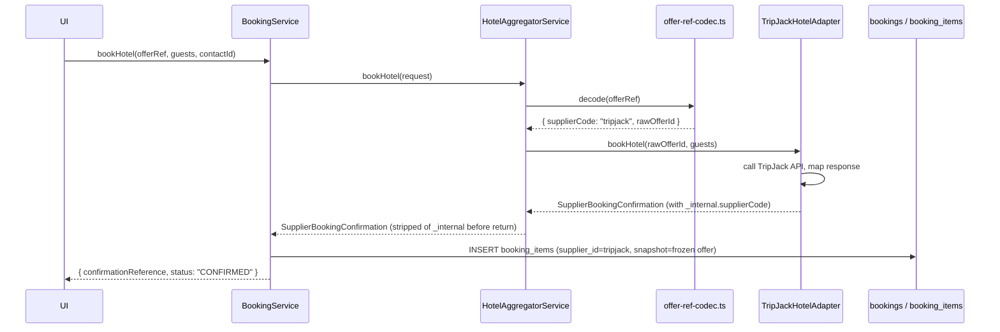
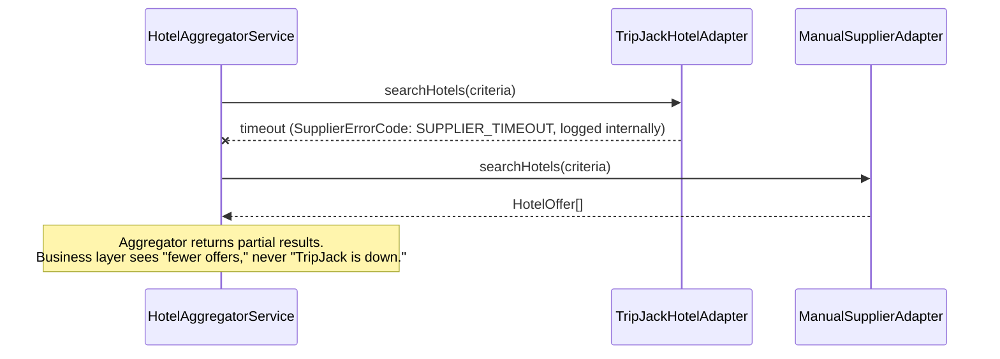
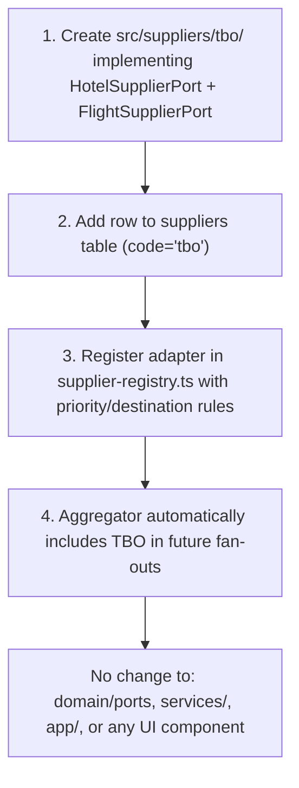

# The Vacation Voice — Travel ERP
## Supplier Abstraction Layer (SAL) Design

**Status:** Design only — no implementation. Builds directly on [DATABASE_SCHEMA.md](DATABASE_SCHEMA.md) (`suppliers`, `supplier_product_mappings`, canonical `hotels`/`activities`) and slots into Phase 3/5 of [ARCHITECTURE_MIGRATION.md](ARCHITECTURE_MIGRATION.md).

---

## 1. Architecture

### 1.1 The one rule everything else follows

> **Business code depends on interfaces named after the product (Hotel, Flight, Activity, Transfer). It never depends on a supplier's name, SDK, auth scheme, or response shape.**

Concretely: `TripJack`, `TBO`, `HotelBeds`, `Makruzz` are strings that appear in exactly one place each in the codebase — their own adapter folder and a row in the `suppliers` table. They do not appear in booking logic, the package builder, the CRM, the AI studio, the Website API, or any React component. This is a standard **Ports & Adapters (Hexagonal) architecture**, specialized for travel supply:

- **Port** — a domain interface (`HotelSupplierPort`, `FlightSupplierPort`, `ActivitySupplierPort`, `TransferSupplierPort`) expressed entirely in canonical vocabulary (our own `Hotel`, `Money`, `DateRange` types from the DB schema) — lives in `src/domain/`.
- **Adapter** — one per supplier, translates that supplier's proprietary request/response format into the canonical shape and back. Lives in `src/suppliers/<supplier-name>/`.
- **Registry** — a runtime table of "which adapters are active for which product type / destination / contract," driven by config + the `suppliers` DB table, not by `if (supplier === 'tripjack')` branches anywhere in business code.
- **Aggregator** — the piece that actually *implements* each Port as seen by business code. It fans a single canonical request out to every registered adapter for that product, merges/dedupes/ranks the results, and hands back one unified list with **opaque offer references** — tokens that only the Aggregator can resolve back to "adapter X, offer Y." This opacity is the actual mechanism that makes TripJack invisible: business code holds an `offerRef` string, not a `{supplier: "tripjack", ...}` object.



### 1.2 Where supplier identity is *allowed* to exist

To be precise rather than absolute: "the business should never know TripJack exists" applies to the **booking/sales/customer/AI path** — the code paths in Section 1.1. It does **not** apply to:

- The **`suppliers` admin/config screen** (ops needs to enable/disable TripJack, rotate its credentials, set its priority order) — this is infrastructure administration, not "the business."
- **Internal logs and the supplier health dashboard** — an on-call engineer debugging a failed booking absolutely needs to see which adapter failed.
- **The `suppliers` database table itself** and `supplier_credentials`.

Everywhere else — booking confirmations, CRM records, package pricing, the AI generation prompt/output, anything a customer or a booking agent sees — is supplier-blind by construction.

### 1.3 Enforcing the boundary (not just convention)

Convention alone doesn't hold under deadline pressure, so the boundary is enforced structurally:

- A lint rule (`no-restricted-imports` / `dependency-cruiser`) forbids any file under `src/app/`, `src/services/`, `src/components/` from importing anything under `src/suppliers/tripjack/`, `src/suppliers/tbo/`, etc. — only `src/suppliers/gateway/*` is importable from outside `src/suppliers/`.
- Canonical DTOs (`HotelOffer`, `SupplierBookingConfirmation`, `SupplierError`) have **no field that names a supplier** in business-facing form — internal supplier identity travels only inside the opaque `offerRef` and in a `_internal` metadata block that is stripped before any response leaves the Gateway.
- Errors are normalized to a canonical `SupplierErrorCode` enum (`RATE_NO_LONGER_AVAILABLE`, `SUPPLIER_TIMEOUT`, `SUPPLIER_REJECTED`, `INVALID_REQUEST`) before they reach business code — a TripJack-specific error string never propagates past its own adapter.

---

## 2. Interfaces

### 2.1 Canonical vocabulary (shared by every adapter and every business consumer)

```ts
// src/domain/models/*
type Money = { amount: number; currency: string };
type DateRange = { start: string /* ISO date */; end: string };
type CanonicalId = string; // our own DB entity id (hotels.id, activities.id, ...)

type OfferRef = string;   // opaque token — only the Aggregator's codec can resolve it

type SupplierErrorCode =
  | "SUPPLIER_TIMEOUT"
  | "SUPPLIER_UNAVAILABLE"
  | "RATE_NO_LONGER_AVAILABLE"
  | "SUPPLIER_REJECTED"
  | "INVALID_REQUEST";

interface SupplierError {
  code: SupplierErrorCode;
  message: string;        // safe to show internally; never shown verbatim to end customers
  retryable: boolean;
}

interface SupplierBookingConfirmation {
  confirmationReference: string;  // OUR reference, not the supplier's raw PNR/voucher number
  status: "CONFIRMED" | "PENDING" | "FAILED";
  ticketingDeadline?: string;
  documents?: { type: string; url: string }[];
  _internal: { supplierCode: string; supplierBookingRef: string }; // stripped before leaving the Gateway
}
```

### 2.2 Base adapter contract

```ts
// src/domain/ports/supplier-adapter.base.ts
type ProductType = "HOTEL" | "FLIGHT" | "ACTIVITY" | "TRANSFER";

interface SupplierHealth {
  healthy: boolean;
  latencyMs: number;
  lastCheckedAt: string;
}

interface SupplierAdapter {
  readonly supplierCode: string;        // e.g. "tripjack" — used only inside gateway/ops, never returned to callers
  readonly capabilities: ProductType[];
  healthCheck(): Promise<SupplierHealth>;
}
```

### 2.3 Domain ports (one per product — this is what business code is written against)

```ts
// src/domain/ports/hotel-supplier.port.ts
interface HotelSearchCriteria {
  destinationId: CanonicalId;
  dateRange: DateRange;
  occupancy: { adults: number; children: number };
  filters?: { starRating?: number; maxPrice?: Money };
}

interface HotelOffer {
  offerRef: OfferRef;
  canonicalHotelId: CanonicalId;        // resolved via supplier_product_mappings — same hotel, one card
  roomType: string;
  rate: Money;
  cancellationPolicy: string;
  refundable: boolean;
}

interface HotelBookingRequest {
  offerRef: OfferRef;
  guests: { name: string; ageType: "ADULT" | "CHILD" }[];
  contactId: CanonicalId;
}

interface HotelSupplierPort extends SupplierAdapter {
  searchHotels(criteria: HotelSearchCriteria): Promise<HotelOffer[]>;
  quotePrice(offerRef: OfferRef): Promise<{ rate: Money; stillAvailable: boolean }>; // re-check before booking
  bookHotel(request: HotelBookingRequest): Promise<SupplierBookingConfirmation>;
  cancelBooking(confirmationReference: string): Promise<{ cancelled: boolean; refund?: Money }>;
  getBookingStatus(confirmationReference: string): Promise<SupplierBookingConfirmation["status"]>;
}
```

```ts
// src/domain/ports/flight-supplier.port.ts
interface FlightSearchCriteria {
  origin: string;  // IATA
  destination: string;
  departDate: string;
  returnDate?: string;
  passengers: { adults: number; children: number; infants: number };
  cabinClass?: "ECONOMY" | "BUSINESS";
}

interface FlightOffer {
  offerRef: OfferRef;
  airlineCode: string;
  segments: { from: string; to: string; departAt: string; arriveAt: string; flightNumber: string }[];
  fare: Money;
  refundable: boolean;
}

interface FlightSupplierPort extends SupplierAdapter {
  searchFlights(criteria: FlightSearchCriteria): Promise<FlightOffer[]>;
  quotePrice(offerRef: OfferRef): Promise<{ fare: Money; stillAvailable: boolean }>;
  bookFlight(request: { offerRef: OfferRef; passengers: unknown[]; contactId: CanonicalId }): Promise<SupplierBookingConfirmation>;
  cancelBooking(confirmationReference: string): Promise<{ cancelled: boolean; refund?: Money }>;
  getBookingStatus(confirmationReference: string): Promise<SupplierBookingConfirmation["status"]>;
}
```

```ts
// src/domain/ports/activity-supplier.port.ts
interface ActivitySearchCriteria {
  destinationId: CanonicalId;
  date: string;
  participants: number;
}

interface ActivityOffer {
  offerRef: OfferRef;
  canonicalActivityId: CanonicalId;
  price: Money;
  durationMinutes: number;
  cancellationPolicy: string;
}

interface ActivitySupplierPort extends SupplierAdapter {
  searchActivities(criteria: ActivitySearchCriteria): Promise<ActivityOffer[]>;
  getAvailability(activityId: CanonicalId, date: string): Promise<{ slot: string; capacity: number }[]>;
  bookActivity(request: { offerRef: OfferRef; participants: number; contactId: CanonicalId }): Promise<SupplierBookingConfirmation>;
  cancelBooking(confirmationReference: string): Promise<{ cancelled: boolean; refund?: Money }>;
}
```

```ts
// src/domain/ports/transfer-supplier.port.ts
// Covers ferries (Makruzz), private cabs, airport transfers — one shape, `mode` distinguishes them
interface TransferSearchCriteria {
  originDestinationId: CanonicalId;
  targetDestinationId: CanonicalId;
  date: string;
  passengers: number;
  mode?: "FERRY" | "ROAD";
}

interface TransferOffer {
  offerRef: OfferRef;
  mode: "FERRY" | "ROAD";
  operatorLabel: string;      // canonical/display label, NOT the raw supplier code
  price: Money;
  departAt: string;
}

interface TransferSupplierPort extends SupplierAdapter {
  searchTransfers(criteria: TransferSearchCriteria): Promise<TransferOffer[]>;
  bookTransfer(request: { offerRef: OfferRef; passengers: number; contactId: CanonicalId }): Promise<SupplierBookingConfirmation>;
  cancelBooking(confirmationReference: string): Promise<{ cancelled: boolean; refund?: Money }>;
}
```

### 2.4 The Gateway — the only import business code is allowed

```ts
// src/suppliers/gateway/supplier-gateway.ts
interface SupplierGateway {
  hotels: HotelSupplierPort;      // implemented by HotelAggregatorService, fanning out to N adapters
  flights: FlightSupplierPort;
  activities: ActivitySupplierPort;
  transfers: TransferSupplierPort;
}
```

Each `X Y implements <Port>` on the Gateway is **not** a single supplier — it's an aggregator that satisfies the exact same interface a single supplier would, so business code cannot tell (and doesn't need to) whether zero, one, or five suppliers answered a given search.

### 2.5 Manual Supplier — same interface, different fulfillment mechanism

```ts
// src/suppliers/manual/manual-supplier.adapter.ts
class ManualSupplierAdapter implements HotelSupplierPort, ActivitySupplierPort, TransferSupplierPort {
  readonly supplierCode = "manual";
  readonly capabilities: ProductType[] = ["HOTEL", "ACTIVITY", "TRANSFER"];
  // searchHotels() reads hotel_contracted_rates WHERE supplier_id = <manual supplier row>
  // bookHotel() just writes a booking_item + confirms immediately — no external call, no async status
}
```

This is the important structural point: a "supplier" in this abstraction is not "a remote API" — it's *any fulfillment source*, including a human typing rates into the CMS. It implements the identical port, so the Aggregator, the Booking Service, and the UI treat a manually-contracted Andaman houseboat operator exactly like a live TripJack quote.

---

## 3. Folder Structure

```
src/
  domain/
    models/
      money.ts
      hotel-offer.ts
      flight-offer.ts
      activity-offer.ts
      transfer-offer.ts
      booking-confirmation.ts
      supplier-error.ts
    ports/
      supplier-adapter.base.ts
      hotel-supplier.port.ts
      flight-supplier.port.ts
      activity-supplier.port.ts
      transfer-supplier.port.ts

  suppliers/
    gateway/
      supplier-gateway.ts            # <- ONLY thing services/ and app/ may import from suppliers/
      hotel-aggregator.service.ts
      flight-aggregator.service.ts
      activity-aggregator.service.ts
      transfer-aggregator.service.ts
      supplier-registry.ts           # active adapters per product type, priority order, feature flags
      offer-ref-codec.ts             # encode/decode opaque offerRef <-> {supplierCode, rawOfferId}
      dedupe.ts                      # cross-supplier same-hotel/activity merge via supplier_product_mappings

    tripjack/
      tripjack.config.ts
      tripjack.client.ts             # raw HTTP/auth — TripJack request/response types live and die here
      tripjack-hotel.adapter.ts
      tripjack-flight.adapter.ts
      tripjack.mapper.ts             # TripJack shape <-> canonical DTO, both directions

    tbo/
      tbo.config.ts
      tbo.client.ts
      tbo-hotel.adapter.ts
      tbo-flight.adapter.ts
      tbo.mapper.ts

    hotelbeds/
      hotelbeds.config.ts
      hotelbeds.client.ts
      hotelbeds-hotel.adapter.ts
      hotelbeds-activity.adapter.ts
      hotelbeds.mapper.ts

    makruzz/
      makruzz.config.ts
      makruzz.client.ts
      makruzz-transfer.adapter.ts    # ferries
      makruzz.mapper.ts

    manual/
      manual-supplier.adapter.ts
      manual.repository.ts           # queries hotel_contracted_rates / activity_supplier_offers

  services/                          # business logic — imports domain/ports + suppliers/gateway ONLY
    booking.service.ts
    itinerary-search.service.ts
    package-builder.service.ts

  app/                               # existing Next.js routes — call services/*, never suppliers/<name>/*
```

`dependency-cruiser` (or an ESLint `no-restricted-imports` pattern) enforces: nothing under `src/app`, `src/services`, `src/components` may import from `src/suppliers/*` except `src/suppliers/gateway`.

---

## 4. API Contracts

These are the **internal** contracts the Gateway exposes to `services/` (and, if the Gateway is later split into its own service, the HTTP contracts it would expose). Every response is already supplier-blind.

### 4.1 Hotel search
```
POST /internal/search/hotels
Request:  { destinationId, checkIn, checkOut, occupancy, filters? }
Response: { offers: HotelOffer[] }   // offerRef opaque, no supplier field
```

### 4.2 Hotel price re-check (mandatory before booking — live rates can move between search and booking)
```
POST /internal/search/hotels/requote
Request:  { offerRef }
Response: { rate: Money, stillAvailable: boolean }
```

### 4.3 Hotel booking
```
POST /internal/bookings/hotels
Request:  { offerRef, guests[], contactId }
Response: { confirmationReference, status }
Errors:   { code: SupplierErrorCode, message, retryable }
```

### 4.4 Flight search / book — identical shape, `flights` instead of `hotels`
```
POST /internal/search/flights      -> { offers: FlightOffer[] }
POST /internal/search/flights/requote -> { fare, stillAvailable }
POST /internal/bookings/flights    -> { confirmationReference, status }
```

### 4.5 Activities
```
POST /internal/search/activities      -> { offers: ActivityOffer[] }
GET  /internal/activities/:id/availability?date=... -> { slots: [...] }
POST /internal/bookings/activities    -> { confirmationReference, status }
```

### 4.6 Transfers (ferries + road)
```
POST /internal/search/transfers    -> { offers: TransferOffer[] }
POST /internal/bookings/transfers  -> { confirmationReference, status }
```

### 4.7 Cancellation / status (uniform across all four products)
```
POST /internal/bookings/:confirmationReference/cancel -> { cancelled, refund? }
GET  /internal/bookings/:confirmationReference/status  -> { status }
```

### 4.8 Inbound supplier webhooks (async ticketing confirmations, cancellations from the supplier side)
```
POST /webhooks/suppliers/:supplierCode/:eventType
```
This is the **one** place a supplier name legitimately appears in a URL — because the supplier itself is calling us and needs a stable, documented endpoint. The handler immediately maps the payload through that supplier's own mapper into a canonical `SupplierWebhookEvent` and publishes *that* internally; nothing downstream of the webhook handler ever sees the raw payload or the supplier name again.

---

## 5. Flow Diagrams

### 5.1 Hotel search — multiple suppliers, one unified result



### 5.2 Booking — Gateway resolves the opaque offerRef back to one adapter



### 5.3 Graceful degradation — one supplier fails, business flow is unaffected



### 5.4 Adding TBO as a new supplier — nothing above the adapter changes



---

## 6. Migration Strategy

The current codebase has **zero** supplier integration — every page's data is a hardcoded `MOCK_*` array. That's actually the ideal starting point: the abstraction can be built *before* TripJack is wired in at all, so TripJack enters the system as "adapter #2," never as a special case business code was originally written around.

**Phase A — Build the skeleton against the Manual adapter only.**
Implement `domain/ports`, canonical models, `SupplierRegistry`, and the four Aggregator services in `suppliers/gateway/`, with exactly one adapter registered: `ManualSupplierAdapter`, reading from `hotel_contracted_rates` / `activity_supplier_offers` (Phase 3 of the DB migration). This replaces today's `MOCK_HOTEL_BOOKINGS`-style arrays with real, persisted, admin-entered data — flowing through the *exact* interface a live supplier will later use. It proves the abstraction with zero external-API risk.

**Phase B — Add TripJack as the second adapter.**
Implement `TripJackHotelAdapter` and `TripJackFlightAdapter`. Register both in `SupplierRegistry`. **No change to `services/`, `app/`, or any component** — they were already coded against `HotelSupplierPort`/`FlightSupplierPort`, not against "Manual" specifically. This is the concrete test of whether the abstraction actually held: if adding TripJack requires touching booking/CRM/package code, the boundary was drawn wrong.

**Phase C — Exercise multi-supplier aggregation for real.**
With Manual + TripJack both live for hotels, build out `dedupe.ts` against real `supplier_product_mappings` data and validate the merge/ranking logic that was previously only theoretical. Extend to Activities and Transfers.

**Phase D — Add HotelBeds, TBO, Makruzz.**
Each is purely additive: new folder under `src/suppliers/`, new `suppliers` row, new registry entry. The import-boundary lint rule guarantees none of them can leak supplier-specific types into business code even by accident.

**Phase E — Harden.**
Per-adapter timeouts and circuit breakers (so one slow supplier can't stall the whole aggregated search), an ops-only supplier health dashboard, contract tests per adapter (recorded fixtures of that supplier's real responses, replayed in CI so a supplier's API change breaks a fast, isolated test — not a booking in production), and a feature-flagged kill switch per supplier in `SupplierRegistry` for incident response.
