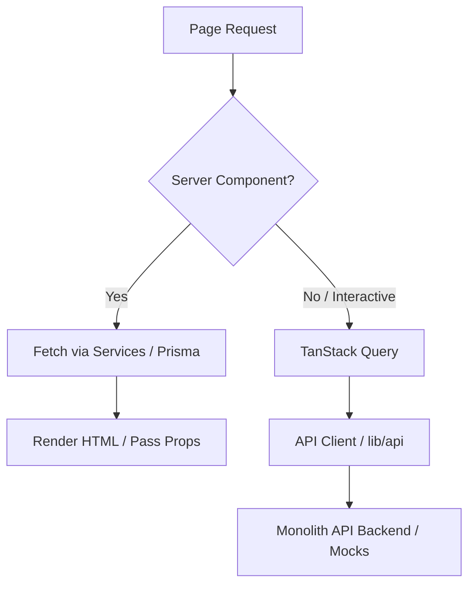

# 01. Frontend Architecture Guide

This document outlines the core architectural patterns and rules for **The Vacation Voice V2** web application. It specifies how we leverage Next.js 15 (App Router), React 19, and TypeScript to build a fast, maintainable, and type-safe travel portal.

---

## 1. Core Paradigm: Server-First Architecture

We default to **React Server Components (RSC)**. Every page, layout, and heavy component starts as a Server Component. 

### Why RSC First?
*   **Zero Bundle Size Impact:** Heavy libraries (e.g., Markdown parsers, date formatters, schema-generator scripts) remain on the server.
*   **Direct Database Access:** In Server Components, we fetch directly from PostgreSQL (for the geographical hierarchy) or the backend API services using secure environments.
*   **Instant Time-to-Interactive (TTI):** Pages are pre-rendered, minimizing JavaScript execution in the browser.
*   **SEO Pre-rendering:** Crawlers receive fully hydrated HTML containing critical metadata and structured JSON-LD schemas.

### Client Component Boundaries
We push the `"use client"` directive as far down the component tree as possible. 
*   **Allowed in Client Components:** User interaction (clicks, hover states, form inputs), local UI state (modals, drawers, interactive accordions), browser APIs (geolocation, local storage), and TanStack Query hook executions.
*   **Forbidden in Client Components:** Direct database queries, raw `fetch` calls to backend endpoints, processing sensitive access tokens, and loading heavy static layout structures.

---

## 2. Feature-Based Architecture

We structure code by business domains (features) rather than technical roles. This prevents directories like `/components` from becoming flat dumps of hundreds of unrelated components.

```
app/                    # Routing, layouts, and page entrypoints
features/               # Business domain features (encapsulated)
  ├── destinations/     # Destination-specific components, hooks, api, components
  ├── packages/         # Package cards, details, booking forms, itineraries
  ├── bookings/         # Booking list, status tracking, customer checkout flow
  ├── auth/             # Login, registration, token refresh, sessions
  └── dashboard/        # Customer profile, wishlist, saved packages
shared/                 # Cross-cutting code used by multiple features
  ├── components/       # Design system primitives (buttons, inputs, section templates)
  ├── hooks/            # Generic hooks (useOutsideClick, useDebounce, etc.)
  ├── services/         # Orchestration layer between APIs and features
  ├── lib/              # Core configs, DB singletons, utility functions
  └── types/            # Global TypeScript interfaces
```

### Feature Isolation Rules
1.  **Strict Boundary:** A feature under `features/foo` can import from `shared/`, but should **never** import directly from the internals of `features/bar`.
2.  **Public API (Barrels):** If `features/packages` needs to reuse a component from `features/destinations`, it must go through a formal public barrel export at `features/destinations/index.ts`.
3.  **No Global Pollution:** Keep feature-specific types inside `features/foo/types.ts` rather than polluting `shared/types/`.

---

## 3. Data Fetching and Hydration

We enforce a strict separation between server-side fetching and client-side fetching.



### Server-Side Data Fetching
*   Performed inside layouts and page components using React Server Components.
*   Uses Next.js caching rules (`revalidate = 300` for listing pages, `revalidate = 60` for fast-moving hierarchy pages).
*   Uses `unstable_cache` with tag invalidation (`revalidateTag`) to cache heavy PostgreSQL queries.

### Client-Side Data Fetching
*   Performed using TanStack Query (`useQuery`, `useMutation`).
*   Queries consume endpoints isolated in `lib/api/` (never calling `fetch` directly inside components).
*   Enables optimistic UI updates, pagination refetching, and retry mechanisms.

---

## 4. Next.js 15 Routing Conventions

We structure the `/app` router logically to support multi-segment SEO URLs and authenticated client spaces.

*   **Dynamic Geographic Hierarchy:** Handled via catch-all routes: `app/destinations/[...slugs]/page.tsx`. This single route resolves complex paths such as `/asia-pacific/india/andaman/havelock` dynamically.
*   **Route Groups:** Used to organize layouts without affecting URL structures (e.g., `app/(account)/login/page.tsx` and `app/(account)/register/page.tsx` sharing a clean `AuthLayout`).
*   **Parallel & Intercepting Routes:** Used for modals (e.g., viewing a package quote form without losing the background package detail context).

---

## 5. Architectural Quality Gates

To ensure the architecture remains clean, we implement compile-time checks:
1.  **Strict TypeScript:** `"strict": true` is enforced. No `any` type escapes code reviews.
2.  **EsLint Import Rules:** Restricts import paths to ensure clean layer separation (e.g. preventing components from importing database packages directly).
3.  **Boundary Linting:** Enforces feature isolation, ensuring `features/auth` does not leak into `features/blog`.
